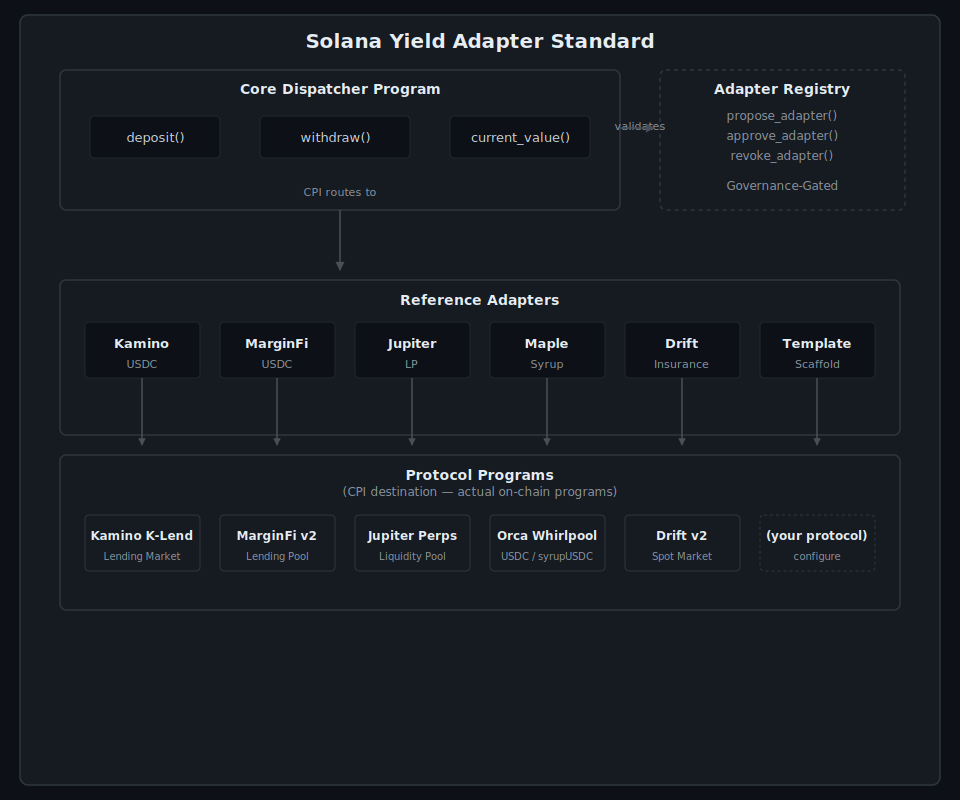

<h1 align="center">
  <code>Solana Yield Adapter Standard</code>
</h1>
<p align="center">
  A standardized <code>deposit</code>, <code>withdraw</code>, and <code>current_value</code> interface for Solana yield protocols.
</p>


<div align="center">

[](docs/fork-run.log)
[](LICENSE)
[](https://crates.io/crates/yield-adapter-trait)
[](https://solana-yield-adapter-standard.vercel.app)

[Adapter Standard](docs/ADAPTER_STANDARD.md) · [Build Your Own](docs/BUILD_YOUR_OWN_ADAPTER.md) · [Documentation](https://syas.mintlify.app) · [Live Demo](https://solana-yield-adapter-standard.vercel.app)

</div>

> **🔬 Live demo: [solana-yield-adapter-standard.vercel.app](https://solana-yield-adapter-standard.vercel.app/)** — the full architecture runs in your browser: connect a wallet, deposit/withdraw through any of the 6 adapters, route via the dispatcher, or toggle vault status — all on devnet. ([source](./packages/demo))

---

## Table of Contents

1. [Overview](#overview)
2. [Architecture](#architecture)
3. [Quick Start](#quick-start)
4. [Reference Adapters](#reference-adapters)
5. [Project Structure](#project-structure)
6. [Testing](#testing)
7. [Deployment](#deployment)
8. [Adapter Standard Specification](#adapter-standard-specification)
9. [Build Your Own Adapter](#build-your-own-adapter)
10. [Security Model](#security-model)
11. [Contributing](#contributing)
12. [License](#license)

---

## Overview

The **Solana Yield Adapter Standard** defines a minimal, composable interface for interacting with yield-bearing protocols on Solana. Think of it as an **ERC-4626 for Solana** — a universal adapter layer that lets wallets, aggregators, and dApps interact with any yield source through three simple instructions:

| Instruction | Description |
|---|---|
| **`deposit(amount)`** | Deposit underlying tokens into the yield source |
| **`withdraw(amount)`** | Withdraw underlying tokens from the yield source |
| **`current_value()`** | Query the current value of a position |

### Why?

Every DeFi protocol on Solana has its own unique interface. This means:
- Aggregators must write custom integration code for each protocol
- Wallets can't display yield positions in a standardized way
- New protocols face adoption friction due to integration overhead

The Yield Adapter Standard solves this by providing a **single interface** that all yield protocols can implement.

---

## Architecture



### Components

| Component | Description |
|-----------|-------------|
| **Yield Adapter Trait** | Shared crate defining the standard interface, types, events, math, and account macros — published on [crates.io](https://crates.io/crates/yield-adapter-trait) |
| **Yield Dispatcher** | Router that validates adapters and tracks user positions |
| **Adapter Registry** | Governance-gated on-chain registry with guardian role for adapter approval/revocation |
| **Reference Adapters** | Five reference adapters + template scaffold |

---

## Quick Start

### Prerequisites

- [Rust](https://rustup.rs/) (1.75+)
- [Solana CLI](https://docs.solana.com/cli/install-solana-cli-tools) (2.2.20+)
- [Anchor CLI](https://www.anchor-lang.com/docs/installation) (1.0.1)
- [Node.js](https://nodejs.org/) (18+)

### Build

```bash
# Clone the repository
git clone https://github.com/your-org/solana-yield-adapter-standard.git
cd solana-yield-adapter-standard

# Install toolchain (Solana 2.2.20 + Anchor 1.0.1)
./scripts/install-toolchain.sh

# Install dependencies
npm install

# Build all programs (.so in target/deploy/)
# Requires Agave 3.1.x platform-tools for SBF: agave-install init 3.1.10
npm run build
```

### Test

```bash
# Run localnet integration tests (32 tests, ~2 min)
npm test

# Run mainnet-fork integration tests via Surfpool (112/112 passing, ~5–15 min)
npm run test:fork
```

> See [tests/README.md](tests/README.md) for the complete fork-test runbook with prerequisites, step-by-step `.env` setup, and troubleshooting.

### Deploy to Devnet

```bash
./scripts/deploy-devnet.sh
```

---

## Reference Adapters

| Adapter | Protocol | Underlying | Model | CPI Round-trip | Status |
|---|---|---|---|---|---|
| **Kamino USDC** | [Kamino Finance](https://kamino.finance) | USDC | Share-based lending vault | ✅ Real CPI | 🔶 Reference |
| **MarginFi USDC** | [MarginFi](https://marginfi.com) | USDC | Share-based lending vault | ✅ Real CPI | 🔶 Reference |
| **Jupiter LP** | [Jupiter](https://jup.ag) | USDC | Share-based LP vault | ✅ Real CPI | 🔶 Reference |
| **Maple Syrup** | [Maple Finance](https://maple.finance) | syrupUSDC | Swap-and-hold via Orca Whirlpool + Chainlink | ✅ Real Orca CPI | 🔶 Reference |
| **Drift Insurance** | [Drift Protocol](https://drift.trade) | USDC | Spot market deposit; two-phase withdrawal (13d cooldown). IF staking blocked upstream | ⏭️ CPI skipped on fork — upstream instructions disabled | 🔶 Reference |

### Notable Adapters

**Maple Syrup** — Uses Orca Whirlpool to swap USDC ↔ syrupUSDC at deposit/withdraw time, and Chainlink oracle for `current_value`. This is a genuine mainnet-fork CPI round-trip — syrupUSDC has no native Solana program, so the adapter acquires it via a DEX swap.

**Drift Insurance** — Implements the full deposit/withdraw/current_value interface for Drift's spot market, including the two-phase withdrawal lifecycle (request → cooldown → settle). The ideal yield source (Insurance Fund staking) is blocked upstream — see [`Docs/troubleshooting/drift-fork-issues.md`](Docs/troubleshooting/drift-fork-issues.md). A probe script is at `scripts/probe-drift-if.sh`.

> **Fork test status:** All 11 Drift CPI-dependent tests are explicitly skipped on mainnet fork because Drift's deployed bytecode has all instruction handlers commented out (drift-labs/protocol-v2 #2174, 2026-04-01). The adapter code is complete and will pass unchanged once Drift re-enables its program. Non-CPI tests (program load, zero-amount rejection, SDK decoder, position layout) pass on fork.

---

## Project Structure

```
solana-yield-adapter-standard/
├── crates/
│   └── yield-adapter-trait/     # Core interface definitions (shared crate)
├── programs/
│   ├── yield-dispatcher/        # Router with standardized interface
│   ├── adapter-registry/        # Governance-gated adapter registry
│   ├── adapter-kamino/          # Kamino USDC adapter
│   ├── adapter-marginfi/        # MarginFi USDC adapter
│   ├── adapter-jupiter/         # Jupiter LP adapter
│   ├── adapter-maple/           # Maple Syrup adapter
│   ├── adapter-drift/           # Drift Insurance Fund adapter
│   └── adapter-template/        # Scaffold for new adapters
├── tests/
│   ├── helpers/                 # Shared test utilities
│   ├── registry.test.ts         # Registry governance tests
│   └── dispatcher.test.ts       # Dispatcher routing tests
├── scripts/
│   ├── run-fork-surfpool.sh        # Surfpool-based fork tests
│   └── deploy-devnet.sh
├── docs/
│   ├── ADAPTER_STANDARD.md      # Formal specification
│   └── BUILD_YOUR_OWN_ADAPTER.md # Developer guide
├── docs-site/                   # Mintlify documentation site
├── Anchor.toml
├── Cargo.toml
└── README.md
```

---

## Testing

### Test Suites

| Suite | Command | Count |
|-------|---------|-------|
| Unit | `cargo test` | 28 |
| Localnet integration | `anchor test` | 32 (26 passing, 6 pre-existing slippage failures on localnet-only) |
| Mainnet-fork integration (Surfpool) | `bash scripts/run-fork-surfpool.sh` | 124 registered, 12 skipped → **112 executable** |

### Mainnet-Fork Tests

Four of five adapters run real CPI round-trips against live mainnet state
(Kamino, MarginFi, Jupiter, Maple), verified via `invoke_signed`.

Drift's CPI tests are explicitly skipped, not passed. Drift Labs merged
[protocol-v2 #2174](https://github.com/drift-labs/protocol-v2/pull/2174)
("comment out all ixs") on 2026-04-01, disabling every instruction handler
in their deployed program. Any CPI into it — Insurance Fund or otherwise —
returns `AnchorError 101 (InstructionFallbackNotFound)`. This is an upstream
protocol state, not an adapter bug; full evidence in
[Docs/troubleshooting/drift-fork-issues.md](Docs/troubleshooting/drift-fork-issues.md).

| Suite | Result |
|-------|--------|
| Kamino, MarginFi, Jupiter, Maple — deposit → current_value → withdraw | ✅ 70 passing (18/18/18/16) |
| Drift — program-load + non-CPI validation only | ✅ 7 passing |
| Drift — CPI round-trip (deposit/withdraw/value/multi-user/lifecycle) | ⏭️ 5 skipped, see above |
| Dispatcher routing & pause | ✅ 11 passing |
| Registry governance | ✅ 13 passing |

Full transcript with on-chain values, slot numbers, and timings:
[`docs/fork-run.log`](docs/fork-run.log).

Uses [Surfpool](https://surfpool.run) for JIT account fetching, no manual `--clone` flags:

```bash
curl -sL https://run.surfpool.run/ | bash

cp .env.example .env
# Edit .env: MAINNET_RPC_URL=https://mainnet.helius-rpc.com/?api-key=YOUR_KEY

npm run test:fork
```

The script (`scripts/run-fork-surfpool.sh`) builds programs, starts a Surfpool validator, deploys all programs, and runs:

```bash
MAINNET_FORK=1 anchor test --skip-local-validator --skip-build
```

> **Why 124 registered but 112 executable:** Each adapter dynamically registers shared tests (`runConformance`, `addSlippageTests`) at runtime — the static `it()` count is 96, but helpers push the runtime total to 124. Of those, 12 are skipped on fork: 5 `it.skip` + 6 `this.skip` in shared conformance = 11 Drift CPI-related (Drift v2 program has all instructions disabled upstream), plus 1 Maple vault lifecycle check skipped for its custom non-standard status model.

---

## Deployment

### Devnet

```bash
./scripts/deploy-devnet.sh
```

The script will:
1. Build all programs via `scripts/build-sbf.sh` + `scripts/build-idls.sh`
2. Deploy all 7 programs (registry, dispatcher, and all 5 adapters) to devnet
3. Output the deployed program IDs

> **Note:** Keypair files must exist in `target/deploy/` (committed to the repo for localnet, separate keypairs for devnet). The script uses existing keypairs and does not generate new ones.

### Mainnet

For mainnet deployment, use the same flow with `--provider.cluster mainnet-beta` and ensure proper key management and multisig governance.

---

## Adapter Standard Specification

See [docs/ADAPTER_STANDARD.md](docs/ADAPTER_STANDARD.md) for the full specification.

### TL;DR — Three Instructions

Every compliant adapter MUST implement:

```rust
// 1. Deposit underlying tokens, receive receipt tokens
fn deposit(ctx: Context<Deposit>, amount: u64) -> Result<()>;

// 2. Burn receipt tokens, receive underlying tokens
fn withdraw(ctx: Context<Withdraw>, amount: u64) -> Result<()>;

// 3. Query current value of position
fn current_value(ctx: Context<CurrentValue>) -> Result<()>;
```

Every adapter MUST emit standardized events: `DepositEvent`, `WithdrawEvent`, `CurrentValueEvent`.

---

## Build Your Own Adapter

See [docs/BUILD_YOUR_OWN_ADAPTER.md](docs/BUILD_YOUR_OWN_ADAPTER.md) for a step-by-step guide.

**Target: Ship a working adapter in less than a day.**

```bash
# 1. Scaffold
anchor init my-adapter && cd my-adapter

# 2. Add the trait dependency from crates.io
# In Cargo.toml: yield-adapter-trait = "1.0"

# 3. Implement three instructions: deposit, withdraw, current_value

# 4. Register with the on-chain registry
# Call propose_adapter() → wait for governance approval
```

---

## Devnet Deployments

### Programs

| Program | Devnet Program ID |
|---|---|
| Adapter Registry | [`8TAhAne1z4chGzuP9EeXFuYsqyGHzACWuD7sURS3ydAq`](https://explorer.solana.com/address/8TAhAne1z4chGzuP9EeXFuYsqyGHzACWuD7sURS3ydAq?cluster=devnet) |
| Yield Dispatcher | [`8u4YFQiTCR5n5dijVoinXyZ962ngVmFuWKELDUjVCqAR`](https://explorer.solana.com/address/8u4YFQiTCR5n5dijVoinXyZ962ngVmFuWKELDUjVCqAR?cluster=devnet) |
| Adapter Kamino | [`BQMHrbTGx9ruKQN54XzMajLq769ax3e33YJ5FMkowrg9`](https://explorer.solana.com/address/BQMHrbTGx9ruKQN54XzMajLq769ax3e33YJ5FMkowrg9?cluster=devnet) |
| Adapter MarginFi | [`LtccLreoDVj2vurvsWpvfC8PvYTnUpTaxz6P9pDg5Y2`](https://explorer.solana.com/address/LtccLreoDVj2vurvsWpvfC8PvYTnUpTaxz6P9pDg5Y2?cluster=devnet) |
| Adapter Jupiter | [`8QdkGAkLvpN7JPxf3dgKFUXVGPS2LWW4BumbNkVkXkux`](https://explorer.solana.com/address/8QdkGAkLvpN7JPxf3dgKFUXVGPS2LWW4BumbNkVkXkux?cluster=devnet) |
| Adapter Maple | [`GRyFctNGZFhHnpHFyyB8xtYdVtC58ZuwyC63PrEy3Vrk`](https://explorer.solana.com/address/GRyFctNGZFhHnpHFyyB8xtYdVtC58ZuwyC63PrEy3Vrk?cluster=devnet) |
| Adapter Drift | [`2zMNZcFzAx9bFNchTWDqiJGt5H3bCDgo8PW1TTskwcLJ`](https://explorer.solana.com/address/2zMNZcFzAx9bFNchTWDqiJGt5H3bCDgo8PW1TTskwcLJ?cluster=devnet) |
| Adapter Template | [`jbLUHXvc9P26MpQdGXht4aKnbn68i2GijxsFX6RXahV`](https://explorer.solana.com/address/jbLUHXvc9P26MpQdGXht4aKnbn68i2GijxsFX6RXahV?cluster=devnet) |

---

## Security Model

| Layer | Protection |
|-------|------------|
| **Adapter Registry** | Governance-gated approval with optional guardian role prevents malicious adapters from being routed through the dispatcher. Only `Approved` entries pass the CPI gate. |
| **Dispatcher Validation** | Every CPI call validates that the target adapter has `status == Approved` in the registry and verifies vault PDA seeds match registered values. |
| **PDA Authority** | All vault funds are controlled by program-derived addresses. No human key has direct custody over deposited tokens. |
| **Checked Arithmetic** | Share calculations use `checked_*` operations and fall back to u256 arithmetic to prevent overflow, underflow, or precision loss. |
| **Event Auditability** | Every deposit, withdraw, and value query emits standardized events (`DepositEvent`, `WithdrawEvent`, `CurrentValueEvent`) for off-chain monitoring and indexing. |
| **Emergency Pause** | Governance can pause the dispatcher at any time, blocking all deposits and withdrawals until unpaused. |
| **Admin Escape Hatch** | Registry includes a dev-only `force_transfer_governance` instruction gated by a hardcoded admin key for resetting stale governor on persistent forks (Surfpool). Defaults to `Pubkey::default()` in production builds. |

---

## Related Projects

- [syas-quasar](https://github.com/max-de-bug/syas-quasar) — Quasar port with framework benchmark comparisons

---

## Contributing

1. Fork the repository
2. Create a feature branch (`git checkout -b feature/my-adapter`)
3. Implement your changes following the adapter standard
4. Add tests for all new functionality
5. Run `cargo fmt && cargo clippy --workspace`
6. Submit a pull request

---

## License

This project is licensed under the Apache License 2.0 — see the [LICENSE](LICENSE) file for details.

---

<div align="center">

**Built for the Solana ecosystem 🌊**

[Documentation](https://syas.mintlify.app) · [Adapter Standard](docs/ADAPTER_STANDARD.md) · [Report Issue](https://github.com/max-de-bug/solana-yield-adapter-standard/issues)

</div>