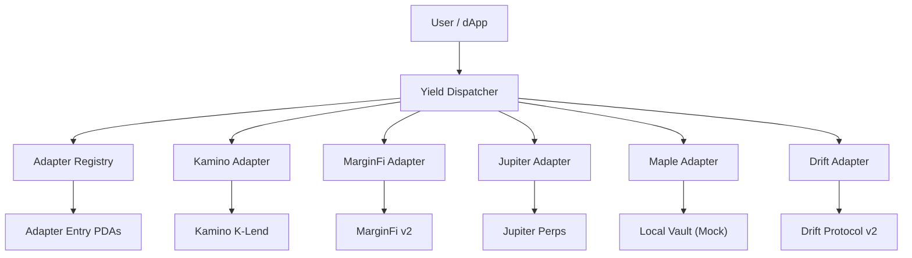
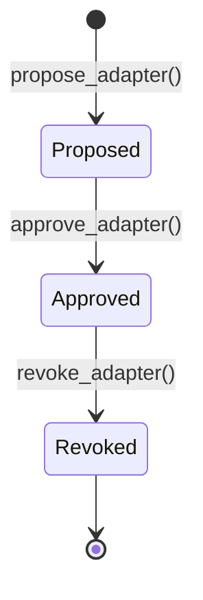

# Architecture

The Yield Adapter Standard consists of four main components:

## System Overview

## Components

### Yield Adapter Trait

A shared Rust crate (not a program) that defines:
- **Account structures**: `AdapterMetadata`, `AdapterPosition`
- **Events**: `DepositEvent`, `WithdrawEvent`, `CurrentValueEvent`
- **Errors**: `YieldAdapterError` (codes 6000-6099)
- **Math helpers**: `calculate_share_price`, `underlying_to_shares`, `shares_to_underlying`

### Yield Dispatcher

The router program that:
1. Validates adapters against the registry
2. Routes `deposit` / `withdraw` / `current_value` calls to adapters
3. Tracks per-user, per-adapter positions via `UserPosition` PDAs
4. Emits dispatch events for off-chain indexing
5. Supports emergency pause by governance

### Adapter Registry

A governance-gated registry that manages adapter lifecycle:

### Reference Adapters

Five production-grade implementations demonstrating the standard:

| Adapter | Protocol | Key Feature |
|---|---|---|
| Kamino | K-Lend | kToken receipt tokens |
| MarginFi | marginfi-v2 | JIT risk engine |
| Jupiter | JLP Pool | Perp liquidity |
| Maple | syrupUSDC | EVM-primary (mock CPI) |
| Drift | Insurance Fund | 13-day cooldown |

## Data Flow

<Steps>
  <Step title="User calls Dispatcher">
    User calls `dispatcher.deposit(adapter_id, amount)`
  </Step>
  <Step title="Registry validation">
    Dispatcher checks the adapter is approved in the Registry
  </Step>
  <Step title="Token transfer">
    Underlying tokens are transferred from user to adapter vault
  </Step>
  <Step title="Position tracking">
    Dispatcher creates/updates a `UserPosition` PDA
  </Step>
  <Step title="Event emission">
    Standardized events are emitted for off-chain indexing
  </Step>
</Steps>
