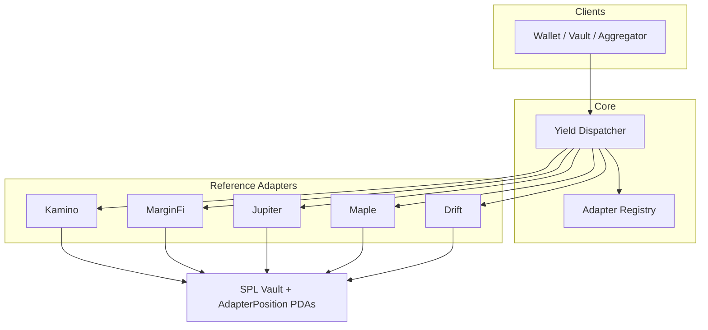
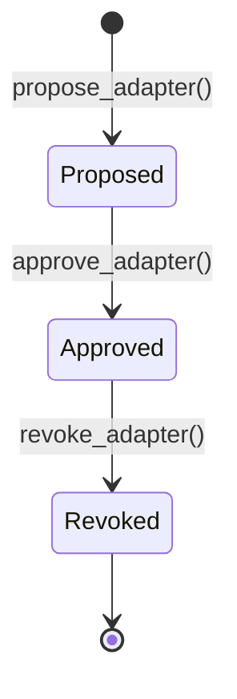

The Yield Adapter Standard separates **routing**, **governance**, and **protocol logic** into distinct on-chain programs plus a shared Rust crate.

## System overview

<Note>
Reference adapters in this repo route USDC through **local SPL vaults**. Dashed protocol CPI in diagrams represents the **production path**, not current behavior. See [Reference vs Production](/guides/reference-implementation).
</Note>

## Components

### Yield Adapter Trait (`crates/yield-adapter-trait`)

A shared library — not a deployable program — that every adapter depends on:

| Export | Purpose |
|---|---|---|
| `DepositEvent`, `WithdrawEvent`, `CurrentValueEvent` | Standardized indexing surface |
| `YieldAdapterError` | Codes `6000–6099` |
| `shares_for_deposit`, `user_position_underlying_value`, `mul_div_u64` | Overflow-safe share math (u256 where needed) |
| `define_adapter_position!` / `declare_standard_accounts!` | Per-user position PDA (`AdapterPosition` / `Position` + `WithdrawalTicket`) |

### Yield Dispatcher

Program ID (devnet): `HUGWpAwFyeWrnH7f9pfWX93puZdC2ud4MYZQT8FtEBvH`

Responsibilities:

1. Verify the target adapter is **Approved** in the registry
2. CPI `deposit` / `withdraw` / `current_value` on the adapter program
3. Maintain `UserPosition` PDAs (dispatcher-level accounting)
4. Emit `DispatchDepositEvent` / `DispatchWithdrawEvent` for indexers
5. Support emergency pause by governance authority

[Full dispatcher reference →](/dispatcher)

### Adapter Registry

Program ID (devnet): `3DQGCPAjHcoT7uf9MJDM5ZTL7GEvTKU3MXFzzrHvqSWt`

Governance-gated adapter lifecycle with two-tier authority:

Anyone may **propose**; the **governance authority** or optional **guardian** may **approve** or **revoke**. Only the authority can transfer governance or set a new guardian. The dispatcher rejects CPI to non-approved adapters.

[Full registry reference →](/registry)

### Reference adapters

Five Anchor programs named after major Solana yield protocols. Each implements the same three-instruction surface with protocol-specific PDA seeds and optional constraints (e.g. Drift two-phase withdrawal).

| Adapter | Devnet program ID | Notable trait |
|---|---|---|
| Kamino | `AjvTbsYhcEehGTSx7yvF4qSiQLWyfeqe3PRhHVyZB3Xe` | Golden reference — simplest full implementation |
| MarginFi | `5yQiba9TNit1FJx3KqXY5nJM3zuQTreqBFWfeGohBqat` | Standard share vault |
| Jupiter | `AwpaZYbeNe3vD17JuGMjsv73b3JuqM3eEoqEVnQk9NMo` | JLP-themed naming |
| Maple | `GohmCi1aDJAfSg4Sp4rELDwku8ptUs8qafF5aju6p5gz` | Real syrupUSDC (yield-bearing SPL) |
| Drift | `4FyuKY2HeXemKoDYoPo1J2xPoeY29YJj7tF7PJLjhS91` | Two-phase withdrawal (13d cooldown) |

## Deposit flow

<Steps>
  <Step title="Client calls dispatcher">
    `deposit(adapter_program_id, amount)` with user token accounts and adapter accounts.
  </Step>
  <Step title="Registry check">
    Dispatcher loads `AdapterEntry` and requires `status == Approved`.
  </Step>
  <Step title="Adapter CPI">
    Dispatcher CPIs `adapter.deposit(amount)`. Adapter transfers underlying user → vault, mints receipt shares to `AdapterPosition`.
  </Step>
  <Step title="Dispatcher accounting">
    Dispatcher updates `UserPosition` and emits `DispatchDepositEvent`.
  </Step>
  <Step title="Indexing">
    Clients listen for `DepositEvent` (adapter) and `DispatchDepositEvent` (dispatcher).
  </Step>
</Steps>

## Account model

Each adapter maintains:

- **`VaultState`** — global `total_underlying`, `total_shares`, mint, authority
- **`AdapterPosition`** — per-user `receipt_token_balance` (PDA: `ADAPTER_POSITION_SEED` + user)
- **`vault_token_account`** — SPL ATA owned by vault authority PDA

The dispatcher maintains its own **`UserPosition`** per `(user, adapter_program_id)` for routed-volume tracking.

## Further reading

<CardGroup cols={2}>
  <Card title="Adapter Standard" icon="file-contract" href="/adapter-standard">
    Normative instruction and event specification.
  </Card>
  <Card title="Build Your Adapter" icon="hammer" href="/guides/build-your-own-adapter">
    Step-by-step guide with conformance checklist.
  </Card>
</CardGroup>
