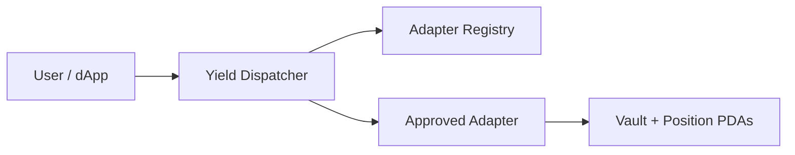

<Note>
This repository is a **reference implementation** submitted for the Superteam Ukraine bounty. Adapters demonstrate the standard with local SPL vaults — production deployments require protocol-specific CPI.
</Note>

## One interface. Every yield source.

Aggregators, wallets, and vaults today integrate each Solana yield protocol with bespoke account layouts and instruction shapes. The **Yield Adapter Standard** unifies that surface into three instructions any compliant adapter must expose.

| Instruction | Purpose |
|---|---|
| `deposit(amount)` | Move underlying tokens into a yield position |
| `withdraw(amount)` | Burn receipt shares and return underlying |
| `current_value()` | Report the caller's position value in underlying units |



## What's in this repo

<CardGroup cols={2}>
  <Card title="Yield Dispatcher" icon="route" href="/dispatcher">
    Single entry point that validates registry approval and CPIs into adapters.
  </Card>
  <Card title="Adapter Registry" icon="shield-check" href="/registry">
    Governance-gated propose → approve → revoke lifecycle for adapters.
  </Card>
  <Card title="Five Reference Adapters" icon="puzzle-piece" href="/adapters/kamino">
    Kamino, MarginFi, Jupiter, Maple, and Drift — share-based SPL vault patterns.
  </Card>
  <Card title="Trait Crate" icon="code" href="/adapter-standard">
  Shared events, errors, math helpers, and `define_adapter_position!` macro.
  </Card>
</CardGroup>

## At a glance

| Metric | Value |
|---|---|
| Programs | 7 (dispatcher, registry, 5 adapters) |
| Test coverage | 16 local + 20 mainnet-fork integration tests |
| Toolchain | Anchor 1.0.1 · Solana 2.2.20 |
| Registry (devnet) | [`CeyDkRge…`](https://explorer.solana.com/address/CeyDkRgegNUz2TeFfFjRdL89G9EGGDymiqHoJkeFGcZ4?cluster=devnet) |

## Get started

<Steps>
  <Step title="Clone and build">
    ```bash
    git clone https://github.com/max-de-bug/solana-yield-adapter-standard.git
    cd solana-yield-adapter-standard
    npm install && npm run build
    ```
  </Step>
  <Step title="Run tests">
    ```bash
    npm test              # 16 local integration tests
    npm run test:fork     # 20 mainnet-fork tests
    ```
  </Step>
  <Step title="Read the spec">
    Start with the [Adapter Standard](/adapter-standard), then follow [Build Your Own Adapter](/guides/build-your-own-adapter).
  </Step>
</Steps>

## Documentation map

<CardGroup cols={3}>
  <Card title="Architecture" icon="diagram-project" href="/architecture">
    How dispatcher, registry, and adapters fit together.
  </Card>
  <Card title="Quick Start" icon="bolt" href="/quickstart">
    Prerequisites, build, test, and devnet deploy in minutes.
  </Card>
  <Card title="Reference Scope" icon="circle-info" href="/guides/reference-implementation">
    What this repo proves vs. what production requires.
  </Card>
</CardGroup>
