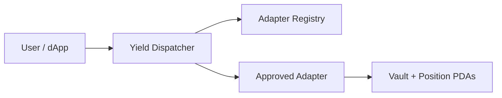

Aggregators, wallets, and vaults today integrate each Solana yield protocol with bespoke account layouts and instruction shapes. The **Yield Adapter Standard** unifies that surface into three instructions any compliant adapter must expose.

| Instruction | Purpose |
|---|---|
| `deposit(amount)` | Move underlying tokens into a yield position |
| `withdraw(amount)` | Burn receipt shares and return underlying |
| `current_value()` | Report the caller's position value in underlying units |

<Tip>
Think of SYAS as **ERC-4626 for Solana** — one interface, many yield sources behind the dispatcher.
</Tip>
