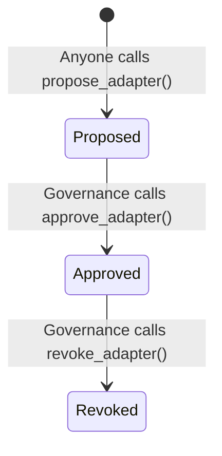

# Adapter Registry

The registry provides a governance-gated approval mechanism for yield adapters. Only approved adapters can be routed through the dispatcher.

## Lifecycle

## Instructions

### `initialize`
Creates the global `RegistryState`. Called once by the deployer.

### `propose_adapter`
**Permissionless.** Anyone can propose an adapter by providing:
- Adapter program ID
- Human-readable name (max 32 chars)
- Metadata URI (max 200 chars)
- Underlying token mint

### `approve_adapter`
**Governance-gated.** Transitions an adapter from `Proposed` → `Approved`.

### `revoke_adapter`
**Governance-gated.** Transitions an adapter from `Approved` → `Revoked`.

### `transfer_governance`
Transfers the governance authority to a new address (e.g., multisig or DAO).

## State

### AdapterEntry

| Field | Type | Description |
|---|---|---|
| `adapter_program_id` | `Pubkey` | The adapter's program ID |
| `name` | `String[32]` | Human-readable name |
| `status` | `enum` | Proposed / Approved / Revoked |
| `underlying_mint` | `Pubkey` | Token this adapter handles |
| `metadata_uri` | `String[200]` | Off-chain metadata URI |
| `proposer` | `Pubkey` | Who proposed this adapter |
| `proposed_at` | `i64` | Proposal timestamp |
| `approved_at` | `i64` | Approval timestamp |
| `revoked_at` | `i64` | Revocation timestamp |
