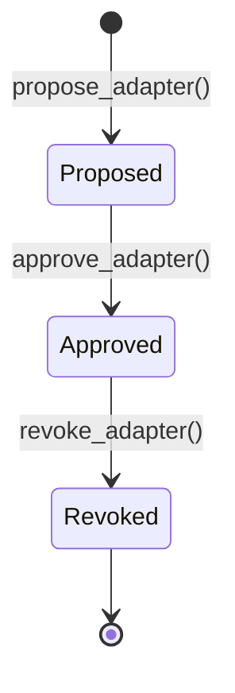

The **Adapter Registry** is the trust anchor for the ecosystem. Only adapters with `Approved` status can be routed through the [dispatcher](/dispatcher).

<Info>
**Devnet program ID:** [`CeyDkRgegNUz2TeFfFjRdL89G9EGGDymiqHoJkeFGcZ4`](https://explorer.solana.com/address/CeyDkRgegNUz2TeFfFjRdL89G9EGGDymiqHoJkeFGcZ4?cluster=devnet)
</Info>

## Lifecycle



| Status | Dispatcher routing | Who can set |
|---|---|---|
| `Proposed` | Blocked | Anyone via `propose_adapter` |
| `Approved` | Allowed | Governance via `approve_adapter` |
| `Revoked` | Blocked | Governance via `revoke_adapter` |

## Instructions

### `initialize`

Creates `RegistryState` with the deployer as initial governance authority.

### `propose_adapter`

**Permissionless.** Registers a new adapter candidate.

<ParamField path="name" type="string" required>
  Human-readable name, max 32 characters.
</ParamField>

<ParamField path="metadata_uri" type="string" required>
  Off-chain metadata URI (JSON), max 200 characters.
</ParamField>

Also requires: `adapter_program_id`, `underlying_mint`.

### `approve_adapter`

**Governance only.** Transitions `Proposed` → `Approved`. Sets `approved_at` timestamp.

### `revoke_adapter`

**Governance only.** Transitions `Approved` → `Revoked`. Existing positions are not auto-closed — integrators should surface revocation to users.

### `transfer_governance`

Transfers authority to a new pubkey (e.g. Squads multisig). Supports pending-accept pattern for two-step handoff.

## `AdapterEntry` account

| Field | Type | Description |
|---|---|---|
| `adapter_program_id` | `Pubkey` | Adapter program to route to |
| `name` | `String[32]` | Display name |
| `status` | `enum` | `Proposed` / `Approved` / `Revoked` |
| `underlying_mint` | `Pubkey` | Token this adapter accepts |
| `metadata_uri` | `String[200]` | Off-chain metadata |
| `proposer` | `Pubkey` | Original proposer |
| `proposed_at` | `i64` | Unix timestamp |
| `approved_at` | `i64` | Approval timestamp (0 if never approved) |
| `revoked_at` | `i64` | Revocation timestamp (0 if never revoked) |

## Example: register an adapter

```typescript
await registryProgram.methods
  .proposeAdapter("My Adapter", "https://example.com/adapter.json")
  .accounts({
    governance: wallet.publicKey,
    registryState,
    adapterEntry: adapterEntryPda(adapterProgramId),
    adapterProgram: adapterProgramId,
    underlyingMint: USDC_MINT,
    systemProgram: SystemProgram.programId,
  })
  .rpc();

// Governance approves
await registryProgram.methods
  .approveAdapter()
  .accounts({ governance, registryState, adapterEntry })
  .rpc();
```

## Post-deployment checklist

<Steps>
  <Step title="Initialize registry">
    `initialize()` with deployer as governance.
  </Step>
  <Step title="Propose each adapter">
    One `AdapterEntry` PDA per adapter program ID.
  </Step>
  <Step title="Approve adapters">
    Governance calls `approve_adapter` for each reference adapter.
  </Step>
  <Step title="Transfer governance">
    Move authority to multisig before mainnet.
  </Step>
</Steps>

See [Deployment guide](/guides/deployment) for the full devnet workflow.
